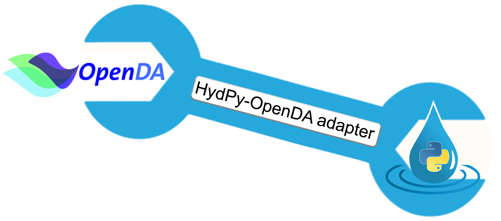

# Optimising HydPy simulations with OpenDA

This repository provides a [wrapper](extensions/HydPyOpenDABBModelWrapper), 
for coupling [HydPy](https://github.com/hydpy-dev/hydpy) (programmed
in Python) to [OpenDA](http://openda.org/) (programmed in Java).
[OpenDA](http://openda.org/) comes with various numerical algorithms for 
calibrating model parameters and improving simulations via data assimilation.  
The design of the [wrapper](extensions/HydPyOpenDABBModelWrapper) is 
sufficiently general to apply these algorithms on all hydrological models 
implemented into [HydPy](https://github.com/hydpy-dev/hydpy).

For a quick overview, see the documentation of the 
[wrapper](extensions/HydPyOpenDABBModelWrapper) itself and the available
the [demo projects](demos).  For a deeper understanding of the possibilities
and limitations of the [wrapper](extensions/HydPyOpenDABBModelWrapper),
see the documentation on [OpenDA](http://openda.org/) and 
[HydPy](https://github.com/hydpy-dev/hydpy) (especially the on the
[HydPy server](https://hydpy-dev.github.io/hydpy/master/servertools.html), as 
well  as the current [OpenDA issues](https://github.com/hydpy-dev/OpenDA/issues)
and [HydPy issues](https://github.com/hydpy-dev/hydpy/issues) related to
[OpenDA](http://openda.org/).

The [wrapper](extensions/HydPyOpenDABBModelWrapper) was implemented
by [Björnsen Consulting Engineers](https://www.bjoernsen.de/index.php?id=bjoernsen&L=2))
on behalf of the [German Federal Institute of Hydrology](https://www.bafg.de/EN/Home/homepage_en_node.html) 
(BfG).

The [wrapper](extensions/HydPyOpenDABBModelWrapper) does work with the
[HydPy](https://github.com/hydpy-dev/hydpy) alpha version 3.2a5 at the moment.
A stable [HydPy](https://github.com/hydpy-dev/hydpy) release supporting
the [wrapper](extensions/HydPyOpenDABBModelWrapper) will follow soon.
