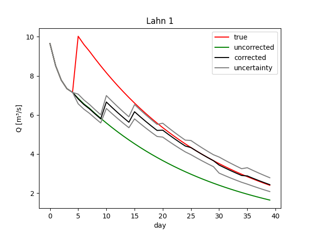
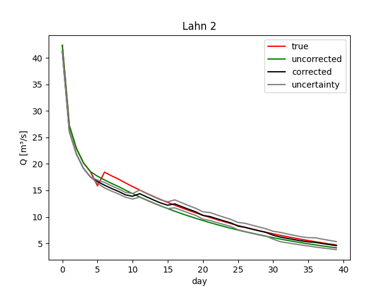
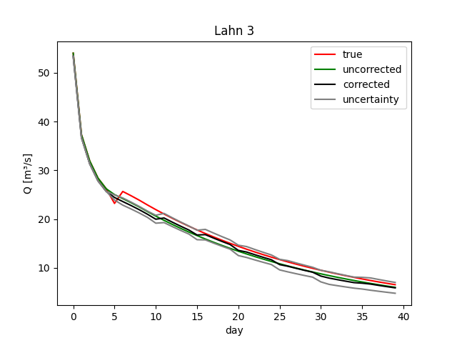

.. _`EnKF`: ../EnKF
.. _`algorithm.xml`: algorithm.xml
.. _`LZ`: https://hydpy-dev.github.io/hydpy/master/hland.html#hydpy.models.hland.hland_states.LZ
.. _`model.xml`: model.xml
.. _`observations.xml`: observations.xml
.. _`spatialNoise.xml`: spatialNoise.xml
.. _`locations_lz.txt`: locations_lz.txt
.. _`LahnH`: https://hydpy-dev.github.io/hydpy/master/examples.html#hydpy.examples.prepare_full_example_1
.. _`OpenDA`: https://www.openda.org/
.. _`main.oda`: main.oda

Adjust model states with the Asynchronous Ensemble Kalman Filter
----------------------------------------------------------------

This example modifies the `EnKF`_ example:

 1. We use the Ensemble Kalman Filter "asynchronously".  Instead of performing
    state updates every simulation step (in the `EnKF`_ example: every day), we
    define a time increment of 5 days in `algorithm.xml`_.
 2. The Asynchronous Ensemble Kalman Filter (AEnKF) uses the (artificial) time
    series of four gauges as observations.  See `model.xml`_ and
    `observations.xml`_.
 3. The AEnKF modifies the four related subbasins' lower zone storage values
    (`LZ`_).  Hence, in contrast to the univariate `EnKF`_ example, the
    geometry configuration in `spatialNoise.xml`_ and the subbasin locations
    given in `locations_lz.txt`_ are now actually relevant.

Prepare the artificial data
...........................

We prepare the `LahnH`_ project like in the `EnKF`_ example:

>>> import os
>>> os.chdir("../../hydpy_projects")
>>> from hydpy import HydPy, pub, print_values, run_subprocess
>>> pub.options.printprogress = False
>>> pub.options.reprdigits = 6
>>> hp = HydPy("LahnH")
>>> pub.timegrids = "1996-01-01", "1996-02-10", "1d"
>>> hp.prepare_everything()

This time, we focus on two subbasins, `lahn_1` and `dill`.  Both are (the only)
headwaters in the `LahnH` catchment:

>>> land_lahn_1 = hp.elements.land_lahn_1
>>> lahn_1 = hp.nodes.lahn_1
>>> land_dill = hp.elements.land_dill
>>> dill = hp.nodes.dill
>>> pub.timegrids.sim.lastdate = "1996-01-06"
>>> hp.simulate()
>>> conditions = hp.conditions

While allowing the AEnKF to modify the `LZ`_ values of all four subbasins, we
distort only those of the two mentioned headwaters:

>>> land_lahn_1.model.sequences.states.lz += 4.0
>>> land_dill.model.sequences.states.lz -= 4.0

Next, we create and record all four gauges' "true" and the "uncorrected"
discharge series.  Note that the distortion of the headwater's `LZ` values also
affects the discharge at the two lower Lahn gauges:

>>> pub.timegrids.sim.firstdate = "1996-01-06"
>>> pub.timegrids.sim.lastdate = "1996-02-10"
>>> hp.simulate()
>>> for node in hp.nodes:
...     node.sim_true = node.sequences.sim.series.copy()
>>> hp.conditions = conditions
>>> hp.simulate()
>>> for node in hp.nodes:
...     node.sim_uncorrected = node.sequences.sim.series.copy()

Finally, we write the artificial "true" discharge of all four gauges to NOOS
files to make them accessible to `OpenDA`_:

>>> for node in hp.nodes:
...     filepath = f"../openda_projects/AEnKF/data/{node.name}_discharge.noos"
...     with open(filepath, "w") as noosfile:
...         _ = noosfile.write("# TimeZone:GMT+1\n")
...         for date, discharge in zip(pub.timegrids.init, node.sim_true):
...             date = date + "1d"
...             line = f"{date.datetime.strftime('%Y%m%d%H%M%S')}   {discharge}\n"
...             _ = noosfile.write(line)
>>> os.chdir("../openda_projects/AEnKF")

Adjust state LZ
...............

The following command starts `OpenDA_` based on `main.oda`, which exactly
resembles the main file of the `EnKF`_ example:

>>> _ = run_subprocess("oda_run_batch main.oda", verbose=False)

For reading the time series of the individual gauges from the
`PythonResultWriter` output file, one needs to rearrange the original data
matrix, taking both the pre-specified order of the gauges (see the comments
included in the output file) and the time
increment into account:

>>> import runpy
>>> results = runpy.run_path("results/final.py")
>>> NAMES = "Dill", "Lahn 1", "Lahn 2", "Lahn 3"
>>> INCREMENT = 5
>>> def get_series(name, std):
...     idx = NAMES.index(name)
...     key = "pred_f_std" if std else "pred_f"
...     return results[key][:, idx*INCREMENT:(idx+1)*INCREMENT].flatten()
>>> lahn_1.sim_corrected = get_series("Lahn 1", False)
>>> dill.sim_corrected = get_series("Dill", False)

At the end of the simulation period, we see a remarkable improvement in the
agreement between the "true" and the "corrected" discharge series for both
headwaters:

>>> print_values(lahn_1.sim_uncorrected[-7:])
2.118165, 2.030685, 1.946818, 1.866414, 1.789331, 1.715432, 1.644584
>>> print_values(lahn_1.sim_corrected[-7:])
3.027342, 2.902313, 2.880374, 2.761415, 2.647368, 2.538032, 2.433211
>>> print_values(lahn_1.sim_true[-7:])
3.092645, 2.964919, 2.842468, 2.725074, 2.612528, 2.504631, 2.40119

>>> print_values(dill.sim_uncorrected[-7:])
1.006758, 0.949917, 0.896284, 0.84568, 0.797933, 0.752882, 0.710374
>>> print_values(dill.sim_corrected[-7:])
0.645061, 0.608641, 0.56005, 0.52843, 0.498595, 0.470444, 0.443883
>>> print_values(dill.sim_true[-7:])
0.651233, 0.614464, 0.579772, 0.547038, 0.516152, 0.48701, 0.459513

When inspecting the whole time series of all gauges, some striking differences
emerge.  The time increment of 5 days causes significant jumps in the results.
Compared different gauges, we see
that the `AEnKF` requires only two or three adjustments to correct the `LZ`_
value of the `lahn_1` catchment but some more steps for the `dill` catchment.
The simulation agreement for `lahn_2` is also satisfactory, which indicates
that the `AEnKF` did not make false `LZ`_ adjustments.  However, there is a
temporary improvement for "lahn_3", but this gets lost until the end of the
simulation period.  Presumably, the `AEnKF` would require more time to tare the
`LZ`_ values of all subbasins to also reach a good result for the catchment's
outlet, which is affected by all modifications above.

>>> from matplotlib import pyplot
>>> for name in NAMES:
...     nodename = name.lower().replace(' ', '_')
...     sim_true = hp.nodes[nodename].sim_true
...     sim_uncorrected = hp.nodes[nodename].sim_uncorrected
...     sim_corrected = get_series(name, False)
...     sim_uncertainty = get_series(name, True)
...     _ = pyplot.plot(sim_true, "red", label="true")
...     _ = pyplot.plot(sim_uncorrected, "green", label="uncorrected")
...     _ = pyplot.plot(sim_corrected, "black", label="corrected")
...     _ = pyplot.plot(sim_corrected + 1.96 * sim_uncertainty, "grey", label="uncertainty")
...     _ = pyplot.plot(sim_corrected - 1.96 * sim_uncertainty, "grey")
...     _ = pyplot.ylabel("Q [m3/s]")
...     _ = pyplot.xlabel("day")
...     _ = pyplot.legend()
...     pyplot.savefig(f"results/discharge_{nodename}.png")
...     pyplot.clf()

.. image:: results/discharge_dill.png

