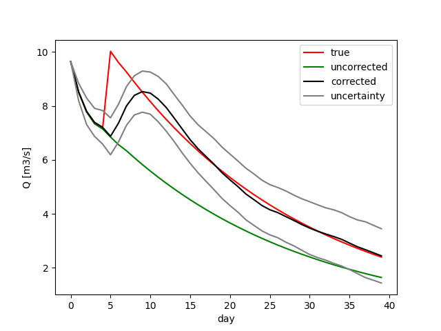

.. _`multiple sequential runs`: ../SeqEnsSim
.. _`OpenDA`: https://www.openda.org/
.. _`calibration example`: ../DUD
.. _`DUD`: https://www.jstor.org/stable/1268154?seq=1#page_scan_tab_contents
.. _`Alpha`: https://hydpy-dev.github.io/hydpy/hland.html#hydpy.models.hland
.. _`LZ`: https://hydpy-dev.github.io/hydpy/hland.html#hydpy.models.hland.hland_states.LZ
.. _`LahnH`: https://hydpy-dev.github.io/hydpy/examples.html#hydpy.core.examples.prepare_full_example_1
.. _`main.oda`: main.oda
.. _`algorithm.xml`: algorithm.xml
.. _`model.xml`: model.xml
.. _`hydpy.xml`: hydpy.xml

Run in parallel
---------------
The given configuration is an example of setting up the model wrapper to
distribute ensemble simulation onto several HydPy server instances.  See
`model.xml`_.

Adjust model states with the Ensemble Kalman Filter
---------------------------------------------------

This example extends the `multiple sequential runs`_ example.  Now `OpenDA`_
does not only perturb some model properties randomly but does so to improve
simulations.  There is also a similarity to the `calibration example`_, in so
far that both are artificial data experiments. In the `calibration example`_,
we checked the `DUD`_ algorithm being able to find the `Alpha`_ value we knew
to be the "true" one.  In this example, we instead distort the model state
`LZ`_ during a simulation run and check the Ensemble Kalman Filter to adjust
another simulation run to this distortion.

Prepare the artificial data
...........................

The procedure to prepare the `LahnH`_ project equals the ones of the
previous examples:

>>> import os
>>> os.chdir('../../hydpy_projects')
>>> from hydpy import HydPy, pub, print_values, run_subprocess
>>> pub.options.printprogress = False
>>> pub.options.reprdigits = 6
>>> hp = HydPy('LahnH')
>>> pub.timegrids = '1996-01-01', '1996-02-10', '1d'
>>> hp.prepare_everything()

We now perform two consecutive simulation runs, the first one throughout
the first five initialised days:

>>> element = hp.elements.land_lahn_1
>>> node = hp.nodes.lahn_1
>>> pub.timegrids.sim.lastdate = '1996-01-06'
>>> hp.simulate()

We save the current model state for later:

>>> conditions = hp.conditions

Before continuing the simulation, we add 4 mm to the base flow storage `LZ`_:

>>> element.model.sequences.states.lz += 4.0
>>> pub.timegrids.sim.firstdate = '1996-01-06'
>>> pub.timegrids.sim.lastdate = '1996-02-10'
>>> hp.simulate()

The modified series of `LZ`_ looks as follows:

>>> print_values(element.model.sequences.states.lz.series[:10])
8.274782, 8.357493, 8.435817, 8.50973, 8.579616, 12.110951, 11.610768,
11.185753, 10.723781, 10.280889

When inspecting the discharge simulated at the catchment outlet, which
we take as the "true" discharge in the following, one sees
an abrupt increase due to the sudden increase of groundwater:

>>> sim_true = node.sequences.sim.series.copy()
>>> print_values(sim_true[:10])
9.647824, 8.517795, 7.781311, 7.344944, 7.153142, 10.025244, 9.611141,
9.259323, 8.876913, 8.510296

We now reset the previously saved model states (with the unmodified
value of `LZ`_) and recalculate the discharge series, taken as the
"uncorrected" simulation result:

>>> hp.conditions = conditions
>>> hp.simulate()
>>> sim_uncorrected = node.sequences.sim.series.copy()
>>> print_values(sim_uncorrected[:10])
9.647824, 8.517795, 7.781311, 7.344944, 7.153142, 6.85088, 6.567878,
6.341747, 6.079833, 5.828735

The Ensemble Kalman Filter needs to know (an estimate of) the "true"
discharge to improve the model states.  As in the `calibration example`_,
we write the "true" series into a *NOOS*  file:

>>> filepath = '../openda_projects/EnKF/data/lahn_1.discharge.noos'
>>> with open(filepath, 'w') as noosfile:
...     _ = noosfile.write('# TimeZone:GMT+1\n')
...     for date, discharge in zip(pub.timegrids.init, sim_true):
...         date = date + '1d'
...         line = f'{date.datetime.strftime("%Y%m%d%H%M%S")}   {discharge}\n'
...         _ = noosfile.write(line)
>>> os.chdir('../openda_projects/EnKF')

Adjust state LZ
...............

The `OpenDA`_ configuration resembles the configuration of the
`multiple sequential runs`_ example.  Notable differences are that file
`main.oda`_ selects the Ensemble Kalman Filter algorithm, file `algorithm.xml`_
enables not only `stochInit` but also `stochForcing` for stepwise state
perturbations, and files `model.xml`_ and `hydpy.xml`_ define an exchange item
for changing the value of state `LZ`_ instead of parameter `Alpha`_.  Using 20
ensemble members and the `SpatialNoiseModel` for generating the stochastic
perturbations, the Ensemble Kalman Filter returns the following corrected
discharge series:

>>> _ = run_subprocess('oda_run_batch main.oda', verbose=False)
>>> import runpy
>>> results = runpy.run_path('results/final.py')
>>> sim_corrected = results['pred_f'][:, 0]

At the end of the simulation period, the simulated discharge corrected
by the Ensemble Kalman Filter approximates the "true" discharge more
closely than the uncorrected discharge:

>>> print_values(sim_uncorrected[-7:])
2.118165, 2.030685, 1.946818, 1.866414, 1.789331, 1.715432, 1.644584
>>> print_values(sim_corrected[-7:])
3.163455, 3.059748, 2.919573, 2.782616, 2.674682, 2.560758, 2.446207
>>> print_values(sim_true[-7:])
3.092645, 2.964919, 2.842468, 2.725074, 2.612528, 2.504631, 2.40119

The following figure shows the results for the entire simulation period
and includes uncertainty bounds for the estimated value of `LZ`_:

>>> sim_uncertainty = results['pred_f_std'][:, 0]
>>> from matplotlib import pyplot
>>> _ = pyplot.plot(sim_true, 'red', label='true')
>>> _ = pyplot.plot(sim_uncorrected, 'green', label='uncorrected')
>>> _ = pyplot.plot(sim_corrected, 'black', label='corrected')
>>> _ = pyplot.plot(sim_corrected + 1.96 * sim_uncertainty, 'grey', label='uncertainty')
>>> _ = pyplot.plot(sim_corrected - 1.96 * sim_uncertainty, 'grey')
>>> _ = pyplot.ylabel('Q [m3/s]')
>>> _ = pyplot.xlabel('day')
>>> _ = pyplot.legend()
>>> pyplot.savefig('results/discharge_lahn_1.png')

