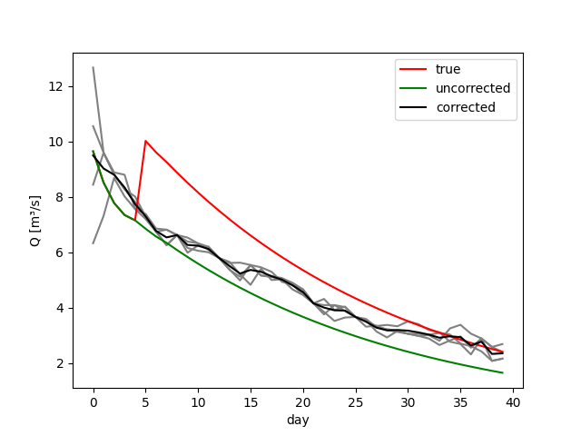

.. _`model.xml`: model.xml
.. _`EnKF`: ../EnKF
.. _`main.oda`: main.oda
.. _`algorithm.xml`: algorithm.xml
.. _`hydpy.properties`: hydpy.properties
.. _`observations.xml`: observations.xml
.. _`hydpy.xml`: hydpy.xml
.. _`stochObsUncertainties.xml`: stochObsUncertainties.xml
.. _`LZ`: https://hydpy-dev.github.io/hydpy/master/hland.html#hydpy.models.hland.hland_states.LZ

Run in parallel
...............

The given configuration is an example of setting up the model wrapper to distribute
ensemble simulation onto several HydPy server instances.  See `model.xml`_.

Adjust model states with the Particle Filter
--------------------------------------------

This example modifies the `EnKF`_ example:

 1. We tell `main.oda`_ to use the Particle Filter instead of the Ensemble Kalman
    Filter. Its configuration in `algorithm.xml`_ is nearly identical to the `EnKF`_
    example, except for the additional definition of a sampling method (the only
    currently available option is `residual resampling`).
 2. In the `EnKF`_ example, all ensemble members start from the same initial state.
    This time, all ensemble members start with different conditions (as if we would
    execute today's forecasting run based on the results of yesterday's forecasting
    run).  Therefore, we must add the XML element `restartInfo` to `model.xml`_ and the
    `stateConditionsFile` property to `hydpy.properties`_, for which we advise defining
    the values given in this example.  Additionally, we need to define the naming
    convention for the directories containing the member-specific conditions via the
    `inputConditionsDir` property.
 3. The HydPy Server supplies the faked "true" discharge to OpenDA.  Therefore, we store
    the related artificial data in HydPy's `asc` files instead of Noos files and select
    `IoObjectStochObserver` instead of `NoosTimeSeriesStochObserver` in `main.oda`_.
    Consequently, the required content of `observations.xml`_ changes, which now
    separates specifying the source and the uncertainty of the observed data.  The class
    `HydPyIoObject` takes care of querying the data from the HydPy Server.  Therefore,
    HydPy must first read the data and prepare a suitable exchange item, which requires
    extending `hydpy.xml`_.  Regarding uncertainty, we select OpenDA's
    `UncertaintyEngine`, which introduces the new configuration file
    `stochObsUncertainties.xml`_.  This approach offers more flexibility than using the
    `NoosTimeSeriesStochObserver`.  For example, one can now select different types of
    probability distribution functions to define observed data's uncertainty.

Prepare the artificial data
...........................

We prepare the same artificial data as for the `EnKF`_ example:

>>> import os
>>> os.chdir("../../hydpy_projects")
>>> from hydpy import HydPy, pub, print_values, run_subprocess
>>> pub.options.printprogress = False
>>> pub.options.reprdigits = 6
>>> hp = HydPy("LahnH")
>>> pub.timegrids = "1996-01-01", "1996-02-10", "1d"
>>> hp.prepare_everything()

>>> element = hp.elements.land_lahn_1
>>> node = hp.nodes.lahn_1
>>> hp.update_devices(elements=element, nodes=node)
>>> pub.timegrids.sim.lastdate = "1996-01-06"
>>> hp.simulate()
>>> conditions = hp.conditions

>>> element.model.sequences.states.lz += 4.0
>>> pub.timegrids.sim.firstdate = "1996-01-06"
>>> pub.timegrids.sim.lastdate = "1996-02-10"
>>> hp.simulate()
>>> sim_true = node.sequences.sim.series.copy()

>>> hp.conditions = conditions
>>> hp.simulate()
>>> sim_uncorrected = node.sequences.sim.series.copy()

However, this time we save the "true" discharge in HydPy's `asc` format, enabling the
HydPy Server to supply it as the observation data required by OpenDA:

>>> node.sequences.obs.series = sim_true
>>> os.chdir("../openda_projects/PF")
>>> pub.sequencemanager.currentdir = os.path.abspath("data")
>>> pub.sequencemanager.overwrite = True
>>> node.sequences.obs.save_series()

Additionally, we prepare individual initial conditions for all ensemble members by
modifying `LZ`_ and write them to member-specific subdirectories.  Therefore, we first
reload the original initial conditions:

>>> os.chdir("../../hydpy_projects")
>>> pub.timegrids.sim.firstdate = "1996-01-01"
>>> hp.load_conditions()

The first directory provides the data for the main ensemble member, reflecting the best
guess of the complete ensemble.  We set its `LZ`_ value to 8 mm:

>>> os.chdir("../openda_projects/PF")
>>> hp.elements.land_lahn_1.model.sequences.states.lz = 8.0
>>> pub.conditionmanager.currentdir = os.path.abspath("data/conditions_00")
>>> hp.save_conditions()

We define only ten members in `algorithm.xml`_ because the implementation of the
Particle Filter currently relies on exchanging much data via files and is thus much
slower than, for example, the implementation of the Ensemble Kalman Filter.  These ten
ensemble members start with `LZ`_ values ranging from 4 to 12 mm:

>>> import numpy
>>> for idx, lz in enumerate(numpy.linspace(4.0, 12.0, 4)):
...     hp.elements.land_lahn_1.model.sequences.states.lz = lz
...     member = str(idx + 1).rjust(2, "0")
...     pub.conditionmanager.currentdir = os.path.abspath(f"data/conditions_{member}")
...     hp.save_conditions()

Adjust state LZ
...............

Like in the `EnKF`_ example, we can query the corrected discharge series after running
OpenDA by loading the `pred_f` array from the resulting `final.py` file:

>>> _ = run_subprocess("oda_run_batch main.oda", verbose=False)
>>> import runpy
>>> results = runpy.run_path("results/final.py")
>>> sim_corrected = results["pred_f"][:, 0]

In this example, the Particle Filter takes much longer to adjust `LZ`_ but at least
reaches a close approximation of the "true" discharge at the end of the simulation
period:

>>> print_values(sim_uncorrected[-7:])
2.118165, 2.030685, 1.946818, 1.866414, 1.789331, 1.715432, 1.644584
>>> print_values(sim_corrected[-7:])
2.910938, 2.964189, 2.931574, 2.630573, 2.768182, 2.325961, 2.347302
>>> print_values(sim_true[-7:])
3.092645, 2.964919, 2.842468, 2.725074, 2.612528, 2.504631, 2.40119

We load the discharges of the individual ensemble members from the NetCDF files
within the member-specific result directories:

>>> from netCDF4 import Dataset
>>> sim_qs = []
>>> for idx in range(1, 5):
...     filepath = f"results/instance_{str(idx).rjust(2, '0')}/series/node_sim_q.nc"
...     with Dataset(filepath) as ncfile:
...         sim_qs.append(ncfile["sim_q"][:, 0])

The time series of the individual NetCDF files can be highly discontinuous due to the
Particle Filter's strategy of removing the worse and duplicating the better ensemble
members:

>>> print_values(sim_qs[0][:7])
6.324971, 7.315168, 8.683226, 8.016613, 7.562901, 7.38678, 6.856517

The following figure shows the slow progression of the ensemble towards the "true"
discharge:

>>> from matplotlib import pyplot
>>> for sim_q in sim_qs:
...     _ = pyplot.plot(sim_q, "grey")
>>> _ = pyplot.plot(sim_true, "red", label="true")
>>> _ = pyplot.plot(sim_uncorrected, "green", label="uncorrected")
>>> _ = pyplot.plot(sim_corrected, "black", label="corrected")
>>> _ = pyplot.ylabel("Q [m³/s]")
>>> _ = pyplot.xlabel("day")
>>> _ = pyplot.legend()
>>> pyplot.savefig("results/discharge_lahn_1.png")

Unfortunately, there are some periods where the complete ensemble collapses to a single
state (even more visible when enlarging the ensemble size).  For example, this happens
around January 20:

>>> for sim_q in sim_qs:
...     print_values(sim_q[19:24])
4.837738, 4.66079, 4.153893, 4.090537, 4.089549
4.65794, 4.455157, 4.153893, 3.753347, 4.089549
4.897043, 4.657431, 4.153893, 4.313108, 3.912578
4.826983, 4.473287, 4.153893, 3.844529, 3.517095

We are not sure about the cause of this flaw yet.